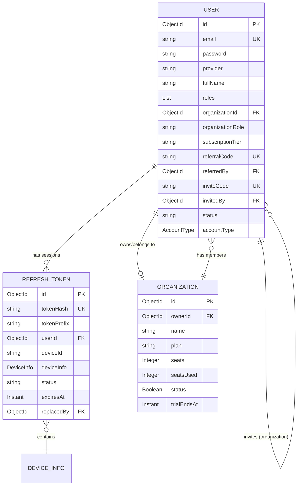
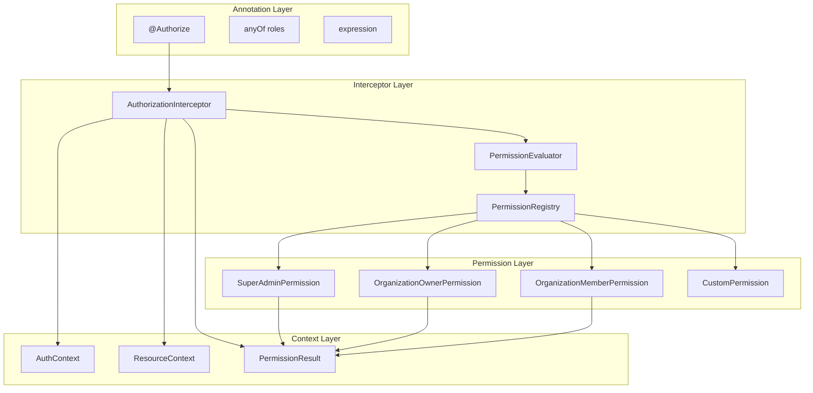
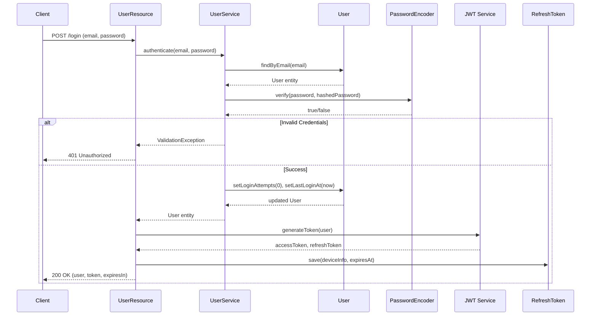
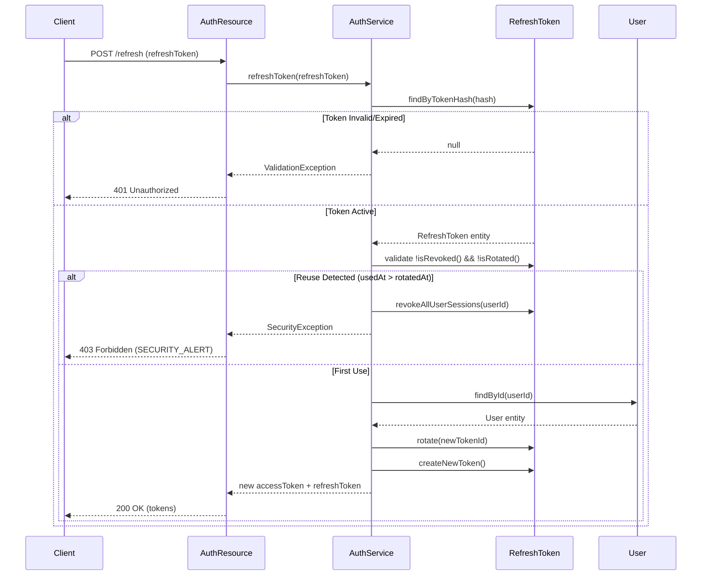
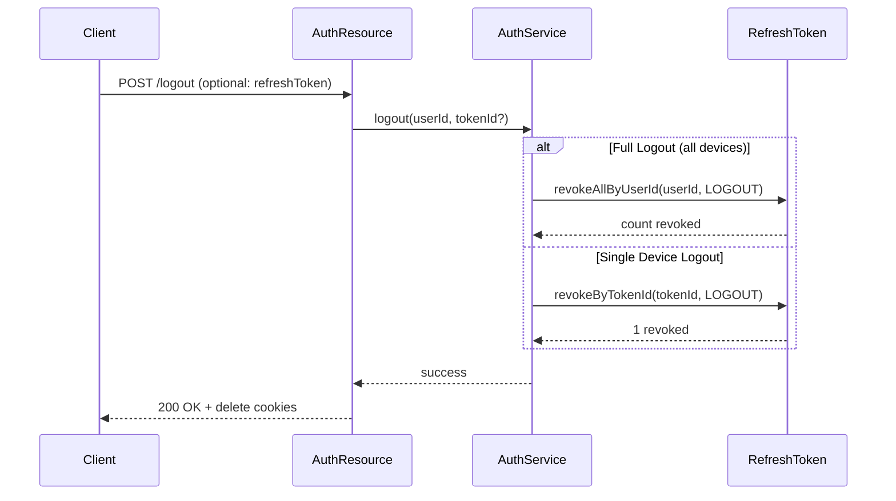

# Domain Models Analysis - PsychAPI

## 📋 Executive Summary

Project ini adalah **platform psikologi multi-tenant** dengan fitur:

- **User Management** dengan referral system dan organization invitation
- **Organization Management** dengan subscription dan seat management
- **Authentication System** dengan JWT + Refresh Token rotation
- **Multi-device Session Management**

---

## 🏗️ Architecture Overview

```
┌─────────────────────────────────────────────────────────────────┐
│                        PsychAPI                                 │
├─────────────────────────────────────────────────────────────────┤
│  Feature Layers:                                                │
│  ├── feature/user/         (User management & referral)         │
│  ├── feature/organization  (Organization & subscription)        │
│  └── feature/auth          (Authentication & session mgmt)      │
├─────────────────────────────────────────────────────────────────┤
│  Shared Layers:                                                 │
│  ├── shared/util/          (MongoFilter, ValidationUtils)       │
│  ├── shared/response/      (ApiResponse, ResponseHelper)        │
│  └── infrastructure/       (PasswordEncoder, Exceptions)        │
└─────────────────────────────────────────────────────────────────┘
```

---

## 📊 Entity Relationship Diagram



---

## 📁 Domain Models Detail

### 1. User (`feature/user/model/User.java`)

**Purpose:** Core user entity dengan fitur lengkap untuk platform multi-tenant.

**Collection:** `users`

**Key Features:**

| Feature                     | Fields                                                                            | Purpose                                       |
| --------------------------- | --------------------------------------------------------------------------------- | --------------------------------------------- |
| **Authentication**          | `email`, `password`, `provider`, `providerId`                                     | Multi-provider auth (local, Google, Facebook) |
| **Profile**                 | `fullName`, `profilePicture`, `phone`, `bio`, `dateOfBirth`, `gender`             | User profile data                             |
| **Roles & Permissions**     | `roles` (List)                                                                    | System roles: USER, ORGANIZATION, ADMIN       |
| **Organization Membership** | `organizationId`, `organizationRole`, `organizationName`                          | Many-to-one relationship dengan Organization  |
| **Subscription**            | `subscriptionTier`, `subscriptionExpiry`, `revenueSharePercentage`                | Monetization & billing                        |
| **Referral System**         | `referralCode`, `referredBy`, `referralIds`, `totalReferrals`, `referralEarnings` | Viral growth mechanism                        |
| **Organization Invitation** | `inviteCode`, `invitedBy`, `invitedOrganizationId`, `invitationStatus`            | Team onboarding                               |
| **Security**                | `status`, `lastLoginAt`, `loginAttempts`                                          | Account lockout & monitoring                  |
| **Account Type**            | `accountType` (INDIVIDUAL/ORGANIZATION)                                           | Distinguish user type                         |

**Business Logic:**

```java
// Factory method dengan referral & invitation logic
User.create(email, password, fullName, referrer, inviter, accountType)

// Helper methods
user.executeUpdate(Bson update)  // Partial update dengan auto-timestamp
user.updateProfile(fullName, phone, bio)
user.softDelete()  // Soft delete pattern
```

**Indexes Required:**

- `email` (unique, sparse)
- `referralCode` (unique)
- `inviteCode` (unique)
- `organizationId` (for filtering members)
- `referredBy` (for referral tracking)
- `status` (for active user filtering)

---

### 2. Organization (`feature/organization/model/Organization.java`)

**Purpose:** Multi-tenant organization entity dengan subscription management.

**Collection:** `organizations`

**Key Features:**

| Feature               | Fields                                                                | Purpose                    |
| --------------------- | --------------------------------------------------------------------- | -------------------------- |
| **Basic Info**        | `name`, `description`, `website`, `logo`, `address`, `phone`, `email` | Organization profile       |
| **Approval Workflow** | `status`, `approvedBy`, `approvedAt`, `rejectionReason`               | Admin verification         |
| **Trial Management**  | `trialStartsAt`, `trialEndsAt`                                        | Free trial period tracking |
| **Subscription**      | `plan`, `subscriptionExpiry`, `seats`, `seatsUsed`                    | Billing & seat management  |
| **Ownership**         | `ownerId`                                                             | Reference ke User (owner)  |

**Plans Supported:**

- `free_trial` - 14 hari trial dengan full features
- `free` - Basic plan dengan limited seats
- `pro` - Paid plan dengan more seats
- `enterprise` - Unlimited seats dengan custom pricing

**Business Logic:**

```java
// Partial update dengan auto-timestamp
org.executeUpdate(Bson update)
```

**Indexes Required:**

- `ownerId` (for filtering user organizations)
- `plan` (for analytics)
- `status` (for approval filtering)
- `trialEndsAt` (for trial expiry notifications)

---

### 3. RefreshToken (`feature/auth/model/RefreshToken.java`)

**Purpose:** Secure refresh token storage dengan rotation dan session management.

**Collection:** `refresh_tokens`

**Key Features:**

| Feature            | Fields                                       | Purpose                                 |
| ------------------ | -------------------------------------------- | --------------------------------------- |
| **Token Security** | `tokenHash`, `tokenPrefix`                   | Hash storage + prefix for UI display    |
| **User & Device**  | `userId`, `deviceId`, `deviceInfo`           | Session tracking per device             |
| **Lifecycle**      | `status`, `expiresAt`, `usedAt`, `rotatedAt` | Token state management                  |
| **Rotation**       | `replacedBy`                                 | Reference ke new token setelah rotation |
| **Revocation**     | `revokeReason`                               | Audit trail untuk revocation            |

**Token Status:**

- `active` - Token valid dan bisa digunakan
- `revoked` - Token dicabut (logout, security alert)
- `expired` - Token melewati expiry time
- `rotated` - Token sudah digantikan (rotation)

**Revoke Reasons:**

- `LOGOUT` - User logout manual
- `USER_REQUESTED` - User revoke dari device management
- `TOKEN_REUSE_DETECTED` - Security: refresh token reuse attempt
- `SECURITY_ALERT` - Suspicious activity detected

**Device Info (Embedded Document):**

```java
DeviceInfo {
    userAgent, browser, browserVersion,
    os, osVersion,
    ip (masked), location (city-level), timezone,
    lastActive
}
```

**Business Logic:**

```java
// State checks
token.isActive()      // ACTIVE status + not expired
token.isExpired()     // expiresAt < now
token.isRevoked()     // REVOKED status
token.isRotated()     // ROTATED status

// Lifecycle methods
token.revoke(reason)        // Mark as revoked
token.rotate(newTokenId)    // Mark as rotated, link to new token
token.markAsUsed()          // Update usedAt timestamp
```

**Security Patterns:**

1. **Refresh Token Rotation** - Setiap refresh menghasilkan token baru
2. **Token Hash Storage** - Raw token tidak disimpan, hanya hash
3. **Token Prefix** - First 8 chars untuk display di UI (e.g., "abc12345...")
4. **Device Fingerprinting** - Track device untuk session display
5. **Reuse Detection** - Jika refresh token digunakan 2x, revoke semua session

**Indexes Required:**

- `tokenHash` (unique)
- `userId` + `status` (composite, untuk find active sessions)
- `deviceId` (for device management)
- `expiresAt` (TTL index)

---

### 4. DeviceInfo (Embedded Document)

**Purpose:** Embedded document di RefreshToken untuk session tracking.

**Not a Collection** - Embedded di `refresh_tokens` document.

**Fields:**

| Field            | Type    | Purpose                                |
| ---------------- | ------- | -------------------------------------- |
| `userAgent`      | String  | Raw user agent string                  |
| `browser`        | String  | Browser name (Chrome, Firefox, Safari) |
| `browserVersion` | String  | Browser version                        |
| `os`             | String  | OS name (Windows, macOS, iOS, Android) |
| `osVersion`      | String  | OS version                             |
| `ip`             | String  | Masked IP (last octet removed)         |
| `location`       | String  | City-level location                    |
| `timezone`       | String  | User timezone                          |
| `lastActive`     | Instant | Last activity timestamp                |

**Privacy Considerations:**

- IP address di-mask untuk GDPR compliance
- Location hanya city-level, tidak koordinat exact
- User agent parsing dilakukan di backend, tidak expose raw data ke client

---

## 🔗 Entity Relationships

### 1. User ↔ Organization (Many-to-One)

```
User.organizationId → Organization.id
```

**Business Rules:**

- User bisa belong to satu Organization
- Organization bisa have banyak Users (members)
- `organizationRole` menentukan permissions: `owner`, `admin`, `member`
- `organizationName` denormalized di User untuk performance

**Cascade Operations:**

- Jika Organization di-delete → Update all members: `organizationId = null`
- Jika User leave organization → `seatsUsed--`

---

### 2. User ↔ User (Self-Referencing: Referral)

```
User.referredBy → User.id
User.referralIds → [User.id, User.id, ...]
```

**Business Rules:**

- Referral bersifat one-to-many (referrer → referrals)
- `referralCode` unik per user, auto-generated saat register
- Stats denormalized: `totalReferrals`, `successfulReferrals`, `referralEarnings`
- Self-referral dicegah di service layer

**Referral Flow:**

```
1. User A register dengan referralCode User B
2. UserService validate referralCode → find User B
3. Set User A.referredBy = User B.id
4. Update User B: referralIds.add(User A.id), totalReferrals++
```

---

### 3. User ↔ User (Self-Referencing: Invitation)

```
User.invitedBy → User.id
User.invitedOrganizationId → Organization.id
```

**Business Rules:**

- Invitation untuk join organization
- `invitationStatus`: `pending`, `accepted`, `declined`, `expired`
- `invitationRole`: role yang ditawarkan di organization
- Invitation bisa via `inviteCode` atau direct add

**Invitation Flow:**

```
1. Owner/Admin invite user via email
2. System generate inviteCode untuk invitee
3. Invitee register dengan inviteCode
4. Set invitee: invitedBy, invitedOrganizationId, organizationRole
5. Auto-join organization
```

---

### 4. User ↔ RefreshToken (One-to-Many)

```
RefreshToken.userId → User.id
```

**Business Rules:**

- User bisa have multiple active sessions (multiple devices)
- Token rotation: setiap refresh menghasilkan token baru
- Max active tokens per user (configurable, default: 10)
- Token reuse detection → revoke all sessions

**Rotation Flow:**

```
1. Client send refresh token
2. Find RefreshToken by tokenHash
3. Validate: isActive() && !isExpired()
4. Generate NEW refresh token
5. Create new RefreshToken document
6. Mark old token: status = ROTATED, replacedBy = newTokenId
7. Return new access token + new refresh token
```

---

### 4. RefreshToken ⊕ DeviceInfo (Embed)

```
RefreshToken.deviceInfo = DeviceInfo { ... }
```

**Embedding Rationale:**

- DeviceInfo selalu diakses bersama RefreshToken
- Tidak perlu query terpisah
- Document size tetap kecil (< 1KB)
- Atomic updates untuk device info

## 🎯 Authentication & Authorization Flow

### Authorization Architecture

Project ini menggunakan **Dynamic Authorization Interceptor** berbasis CDI untuk role-based access control yang clean, extensible, dan non-redundant.



**Layer Responsibilities:**

| Layer                 | Components                                                              | Responsibility                                         |
| --------------------- | ----------------------------------------------------------------------- | ------------------------------------------------------ |
| **Annotation Layer**  | `@Authorize`                                                            | Declarative security di Resource methods               |
| **Interceptor Layer** | `AuthorizationInterceptor`, `PermissionEvaluator`, `PermissionRegistry` | Extract context, evaluate permissions, route decisions |
| **Permission Layer**  | `SuperAdminPermission`, `OrganizationOwnerPermission`, etc.             | Business rules untuk setiap role                       |
| **Context Layer**     | `AuthContext`, `ResourceContext`, `PermissionResult`                    | Type-safe runtime data containers                      |

**Usage Example:**

```java
@DELETE
@Path("/{orgId}")
@Authorize(anyOf = {"SUPERADMIN", "ORGANIZATION_OWNER"})
public Response deleteOrganization(
        @PathParam("orgId") String orgId,
        @Valid DeleteOrganizationRequest request,
        @Context SecurityContext securityContext,
        @Context UriInfo uriInfo) {

    // Extract authorization result dari interceptor
    PermissionResult permissionResult = (PermissionResult) uriInfo.getRequestContext()
        .getProperty("PERMISSION_RESULT");

    String userId = getUserIdFromSecurityContext(securityContext);

    // Business logic bercabang berdasarkan role
    if (permissionResult.isSuperAdmin()) {
        return organizationService.deleteOrganizationAsSuperAdmin(orgId, userId, request.confirmation());
    } else if (permissionResult.isResourceOwner()) {
        return organizationService.deleteOrganizationAsOwner(orgId, userId, request.confirmation());
    }

    throw new ValidationException("UNAUTHORIZED", "No valid role for this action");
}
```

**Behavior Comparison:**

| Aspek                        | Super Admin                | Organization Owner                              |
| ---------------------------- | -------------------------- | ----------------------------------------------- |
| Authorization Check          | Pass via `SUPERADMIN` role | Pass via `ORGANIZATION_OWNER` + ownership check |
| Bisa Hapus Org Sendiri       | ✅ Yes                     | ✅ Yes                                          |
| Bisa Hapus Org Orang Lain    | ✅ Yes                     | ❌ No                                           |
| Clear User Organization Info | ❌ No                      | ✅ Yes                                          |
| Member Check                 | Optional                   | Required                                        |
| Audit Trail                  | "Super admin action"       | "Owner action"                                  |

**Extensibility:**

- Tambah role baru = buat class implement `Permission` + register ke `PermissionRegistry`
- Tidak perlu modifikasi interceptor atau annotation
- Contoh permission masa depan: `ReferralOwnerPermission`, `SubscriptionActivePermission`

---

### Login Flow



### Refresh Token Flow



### Logout Flow



---

## 🔐 Security Considerations

### Password Security

- BCrypt hashing dengan work factor 10
- Password tidak pernah disimpan di response DTO
- Password reset via email token (not implemented yet)

### JWT Security

- Access token: Short-lived (15 minutes - 1 hour)
- Refresh token: Long-lived (7 days - 30 days)
- Token rotation: Setiap refresh menghasilkan token baru
- Reuse detection: Jika token digunakan 2x → revoke all sessions

### Session Management

- Max 10 active sessions per user
- Device fingerprinting untuk tracking
- Revocation audit trail (reason, timestamp)

---

## 📈 Scalability Considerations

### Indexing Strategy

| Collection     | Index                  | Type           | Purpose                   |
| -------------- | ---------------------- | -------------- | ------------------------- |
| users          | `email`                | unique, sparse | Login lookup              |
| users          | `referralCode`         | unique         | Referral validation       |
| users          | `inviteCode`           | unique         | Invitation validation     |
| users          | `organizationId`       | standard       | Filter members            |
| users          | `status` + `deletedAt` | compound       | Active user filtering     |
| organizations  | `ownerId`              | standard       | User organizations lookup |
| organizations  | `plan` + `status`      | compound       | Analytics                 |
| refresh_tokens | `tokenHash`            | unique         | Token validation          |
| refresh_tokens | `userId` + `status`    | compound       | Active sessions           |
| refresh_tokens | `expiresAt`            | TTL            | Auto-expiry               |

### Denormalization Trade-offs

**Denormalized Fields:**

- `User.organizationName` - Avoid join untuk display
- `User.organizationRole` - Quick permission check
- `User.referralEarnings` - Performance untuk referral dashboard
- `Organization.seatsUsed` - Quick validation tanpa count

**Consistency Strategy:**

- Update denormalized fields dalam transaction (jika MongoDB support)
- Eventual consistency acceptable untuk referral stats
- Critical fields (seatsUsed) updated synchronously

---

## 🚧 Missing Components (To Be Implemented)

### 1. JWT Service

- Token generation (access + refresh)
- Token validation
- Token signing key management
- JWK support untuk distributed validation
- **Role extraction dari JWT claims untuk authorization**

### 2. Auth Resource

- `POST /auth/login` - Login endpoint & Refresh token endpoint
- `POST /auth/register` - Registration endpoint
- `POST /auth/logout` - Logout endpoint
- `GET /auth/sessions` - List active sessions
- `DELETE /auth/sessions/{deviceId}` - Revoke specific session

### 3. Global Exception Handler

- Exception mapper untuk ValidationException, NotFoundException
- Standardized error response format
- Logging & audit trail

### 4. Security Infrastructure

- JWT authentication filter (existing but needs role extraction)
- **Dynamic Authorization Interceptor** (`@Authorize` annotation + CDI interceptor)
- **Permission System** (`Permission` interface + registry + implementations)
- **AuthContext / ResourceContext / PermissionResult** context classes
- CORS configuration

### 5. Migration Scripts

- MongoDB indexes creation
- TTL indexes setup
- Seed data (super admin user)

### 6. Authorization Refactors

- Refactor `OrganizationService.validateOrganizationAccess()` ke `OrganizationOwnerPermission`
- Apply `@Authorize` ke endpoints yang memerlukan authorization
- Implement `deleteOrganizationAsSuperAdmin()` dan `deleteOrganizationAsOwner()` di service layer

---

## 📋 Next Steps

1. **Implement JWT Service** - Token generation & validation + role extraction
2. **Create Auth Resource** - Login, register, refresh, logout endpoints
3. **Add Global Exception Handler** - Standardized error responses
4. **Configure Security** - JWT filter, CORS
5. **Build Authorization Framework** - `@Authorize` interceptor + permission system
6. **Refactor Organization APIs** - Apply authorization ke endpoints organization
7. **Write Migration Scripts** - Indexes, TTL, seed data
8. **Testing** - Unit tests untuk services, integration tests untuk APIs

---

_Document created: 2026-08-10_
_Last updated: 2026-08-10_
